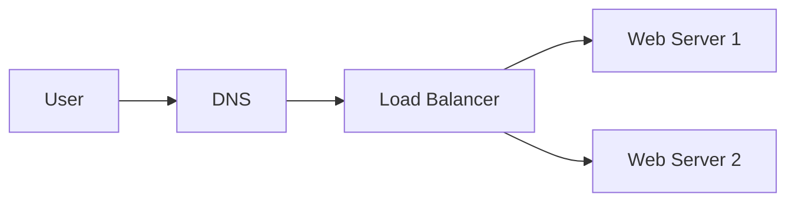
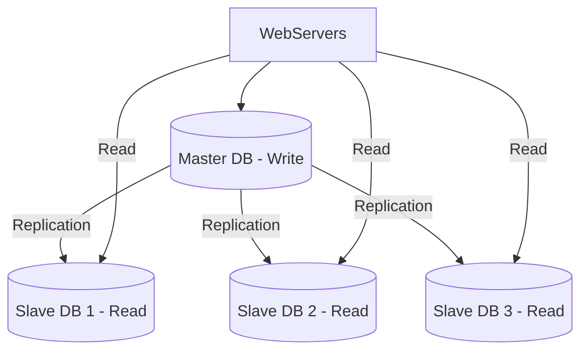
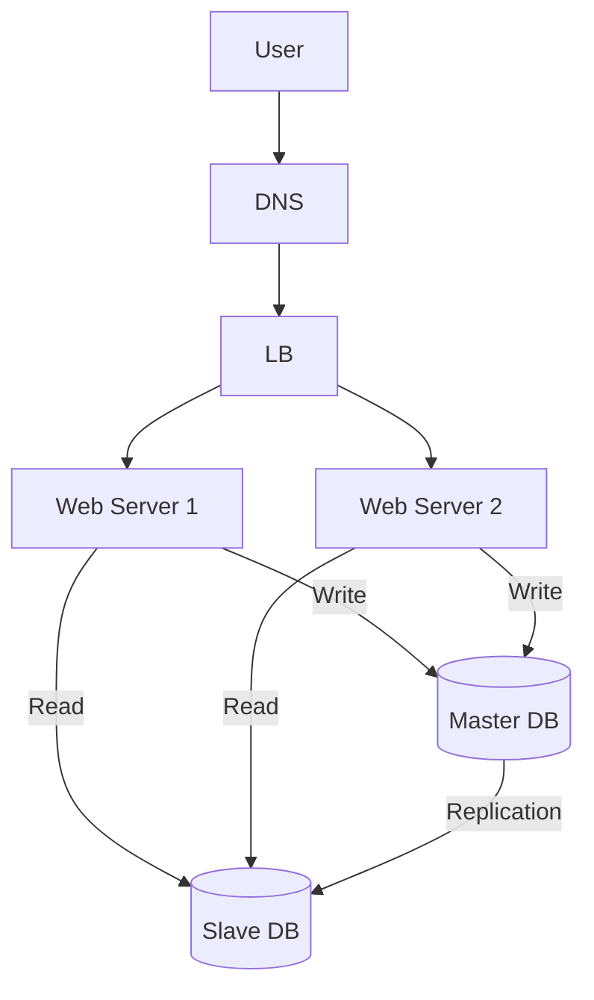
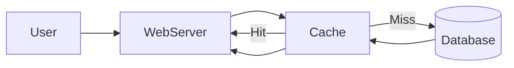
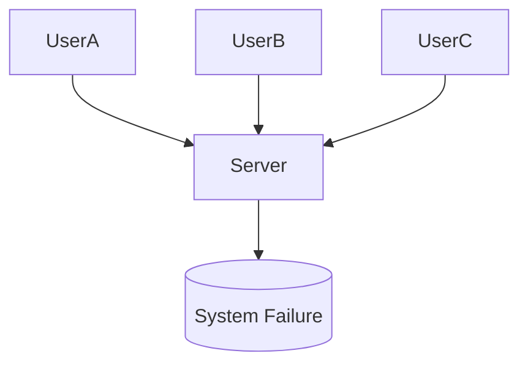
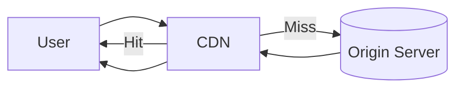
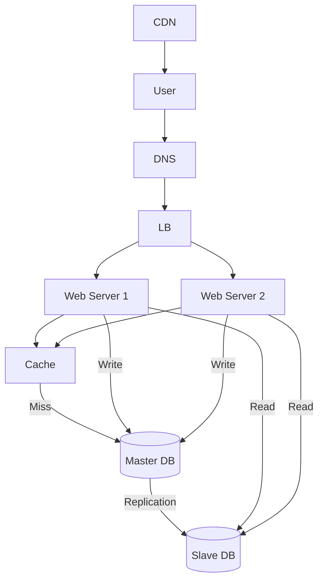

# 🚀 System Design Day 2: Load Balancer, Database Replication, Cache, CDN

---

# 📖 Deep Understanding (Concept First)

Designing a system that can handle millions of users requires solving two major problems:

1. **Handling High Traffic (Scalability)**
2. **Ensuring System Availability (Reliability)**

In the previous step (single server + database separation), we improved structure.  
But still, major issues remain:

---

## ❌ Problems in Current System

### 1. Single Web Server Failure
- If the server goes down → entire application goes down

### 2. High Traffic Overload
- Too many users → server becomes slow or crashes

### 3. Database Bottleneck
- All reads & writes go to one DB → performance issues

---

## ✅ Solution Approach

To solve these problems, we introduce:

- Load Balancer → distribute traffic
- Database Replication → distribute reads
- Cache → reduce DB load
- CDN → improve global performance

---

# ⚖️ 1. Load Balancer

## 📌 What is Load Balancer?

A load balancer evenly distributes incoming requests across multiple servers.

👉 Instead of:
```
User → One Server ❌
```

👉 We do:
```
User → Load Balancer → Multiple Servers ✅
```

---

## 🧠 Why Load Balancer?

- Prevents server overload
- Provides failover
- Improves availability

---

## 🧠 Request Flow

1. User enters domain → `mywebsite.com`
2. DNS returns Load Balancer IP
3. User connects to Load Balancer
4. Load Balancer forwards request to server

---

## 🧩 Diagram



---

## 💡 Key Points

- Users never directly access servers
- Servers use private IPs
- If one server fails → traffic redirects automatically

---

# 🗄️ 2. Database Replication

## 📌 What is Database Replication?

Database replication means maintaining multiple copies of data across different database servers.

---

## 🧠 Concept

- **Master DB**
  - Handles all writes (insert, update, delete)

- **Slave DB**
  - Handles read operations

👉 Reason:
Most applications have **more reads than writes**

---

## 🧩 Diagram



---

## 💡 Advantages

- Better performance (parallel reads)
- High availability
- Data redundancy

---

## 🚨 Failure Handling

### Slave Failure
- Redirect reads to other slaves

### Master Failure
- Promote one slave as new master
- System continues working

---

# 🏗️ 3. Combined Architecture

Now system looks like:

- Load Balancer → handles traffic
- Web Servers → handle logic
- DB Replication → handles data

---



---

# ⚡ 4. Cache Layer

## 📌 What is Cache?

Cache is a fast memory layer that stores frequently accessed data.

---

## 🧠 Problem Without Cache

- Every request hits DB
- DB becomes bottleneck
- Slow response

---

## 🧠 Solution

Store frequently used data in cache

---

## 🧠 Flow

1. Request comes
2. Check cache
3. If hit → return fast 🚀
4. If miss → fetch from DB → store → return

---

## 🧩 Diagram



---

## 💡 Benefits

- Faster response
- Reduced DB load
- Better scalability

---

## ⚠️ Important Concepts

### TTL (Time To Live)
- Defines expiry time of cache

### Consistency
- Cache & DB must stay in sync

### Eviction Policies
- LRU
- LFU
- FIFO

---

# 🚨 Single Point of Failure (SPOF)

## 📌 Problem

If only one component exists → system fails if it crashes

---



---

## ✅ Solution

- Use multiple servers
- Use distributed systems

---

# 🌍 5. CDN (Content Delivery Network)

## 📌 What is CDN?

CDN is a network of geographically distributed servers that deliver static content.

---

## 🧠 Why CDN?

- Users far from server → slow response
- CDN serves content from nearest location

---

## 🧠 Flow

1. User requests static file
2. CDN checks cache
3. If miss → fetch from origin
4. Cache + return

---

## 🧩 Diagram



---

## 💡 Benefits

- Faster load time
- Reduced latency
- Better global performance

---

## ⚠️ Considerations

- Cost
- Cache expiry
- Cache invalidation
- CDN fallback

---

# 🏁 Final Architecture



---

# 🧠 Final Understanding

```text
Single Server
   ↓
Load Balancer
   ↓
Database Replication
   ↓
Cache Layer
   ↓
CDN
```

---

# 🎯 Key Takeaways

- Load Balancer → handles traffic scaling
- DB Replication → handles data scaling
- Cache → improves performance
- CDN → improves global delivery
- Always avoid single point of failure

---

# 🚀 Next Topics

- Consistent Hashing
- Sharding
- Microservices
- API Gateway

---
