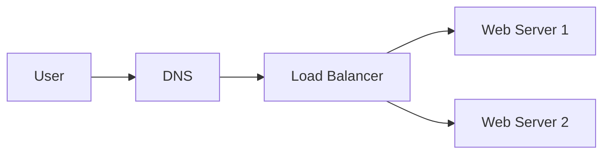
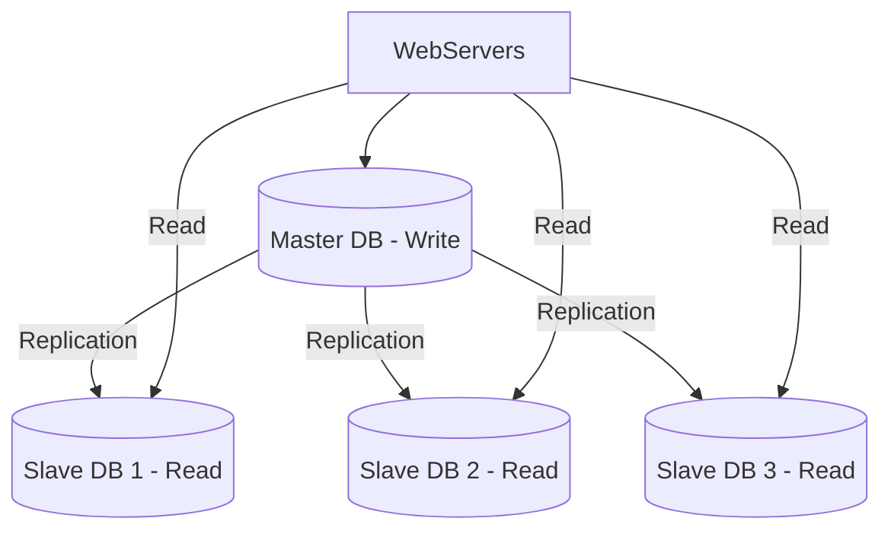
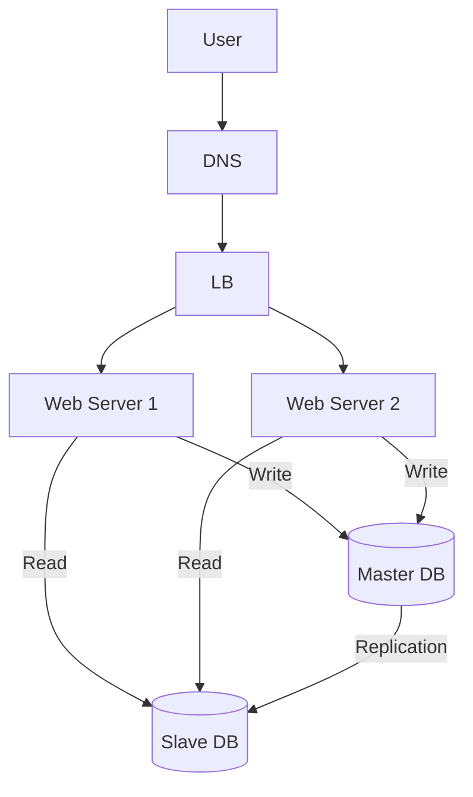
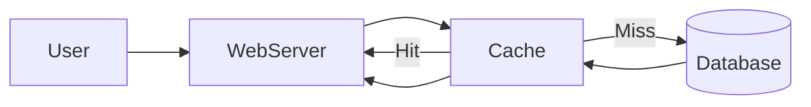
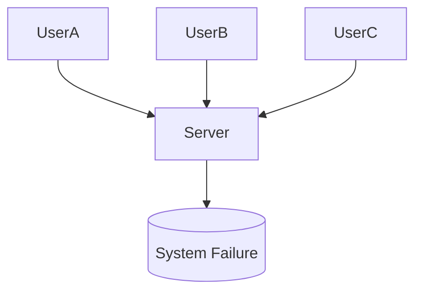
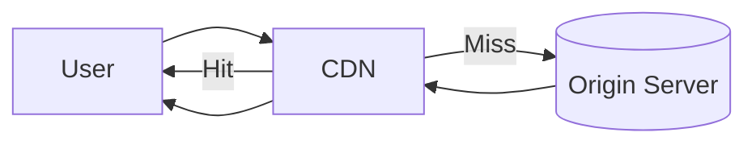
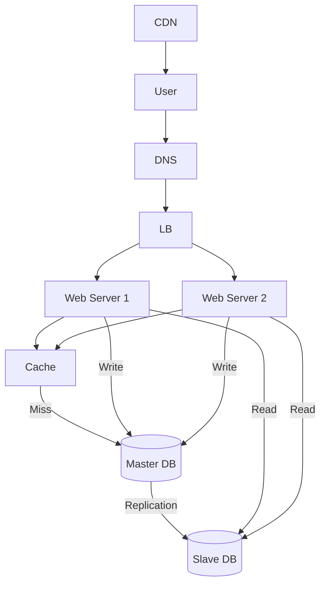

# 🚀 System Design Day 2: Load Balancer, Database Replication, Cache, CDN

---

# ⚖️ 1. Load Balancer

## 📌 Definition
A load balancer is a system that distributes incoming client requests across multiple servers.

---

## 🔑 Key Points
- Distributes traffic evenly
- Prevents server overload
- Provides failover support
- Improves system availability

---

## 🧠 Explanation

In a single server system, all users send requests to one server.  
As traffic increases, this server becomes overloaded and may crash.

A load balancer acts as an entry point:
- Users connect to the load balancer instead of servers
- It forwards requests to multiple servers

This ensures:
- No single server is overloaded
- If one server fails, traffic is redirected to others

---

## 🧩 Diagram

---

# 🗄️ 2. Database Replication

## 📌 Definition
Database replication is the process of copying data from one database (master) to multiple databases (slaves).

---

## 🔑 Key Points
- Master DB → handles write operations
- Slave DB → handles read operations
- Read-heavy systems benefit the most
- Improves performance and reliability

---

## 🧠 Explanation

In most applications:
- Read operations are much higher than write operations

If all reads and writes go to a single database:
- It becomes a bottleneck

Solution:
- Use one master database for writes
- Use multiple slave databases for reads

This distributes load and improves performance.

---

## 🧩 Diagram

---

## 🚨 Failure Handling

### Slave Failure
- Read traffic is redirected to other slaves

### Master Failure
- One slave is promoted to master
- System continues to operate

---

# 🏗️ 3. Combined Architecture

## 📌 Key Points
- Load balancer handles traffic
- Web servers handle logic
- DB replication handles data scaling

---

## 🧠 Explanation

After combining both:
- User request → Load Balancer
- Load Balancer → Web Server
- Web Server:
  - Read → Slave DB
  - Write → Master DB

This creates a scalable and reliable system.

---

## 🧩 Diagram

---

# ⚡ 4. Cache Layer

## 📌 Definition
Cache is a high-speed storage layer used to store frequently accessed data.

---

## 🔑 Key Points
- Stores frequently used data
- Reduces database load
- Improves response time
- Stored in memory (fast access)

---

## 🧠 Explanation

Without cache:
- Every request hits the database
- Database becomes slow under heavy load

With cache:
- Frequently accessed data is stored in memory
- Requests are served faster without hitting DB

---

## 🧠 Flow
1. Request comes to server
2. Check cache
3. If hit → return data
4. If miss → fetch from DB → store in cache → return

---

## 🧩 Diagram

---

## ⚠️ Important Concepts

### TTL (Time To Live)
Defines how long data stays in cache before expiring.

### Consistency
Cache and database must remain synchronized.

### Eviction Policies
- LRU → Least Recently Used
- LFU → Least Frequently Used
- FIFO → First In First Out

---

# 🚨 Single Point of Failure (SPOF)

## 📌 Definition
A single point of failure is a component that, if it fails, brings down the entire system.

---

## 🧠 Explanation

If only one server or cache exists:
- Its failure stops the entire system

---

## 🧩 Diagram

---

## ✅ Solution
- Use multiple servers
- Use distributed cache systems

---

# 🌍 5. CDN (Content Delivery Network)

## 📌 Definition
A CDN is a network of distributed servers used to deliver static content efficiently.

---

## 🔑 Key Points
- Stores static files (images, CSS, JS)
- Delivers content from nearest server
- Reduces latency
- Improves user experience

---

## 🧠 Explanation

If all users fetch content from one server:
- Users far away experience high latency

CDN solves this:
- Content is cached in multiple geographic locations
- Users receive data from the nearest server

---

## 🧩 Diagram

---

## ⚠️ Considerations

- Cost of CDN services
- Cache expiry (TTL)
- Cache invalidation (versioning)
- Handling CDN failures

---

# 🏁 Final Architecture

---

# 🧠 Final Summary

## 🔑 Core Ideas
- Load Balancer → distributes traffic
- DB Replication → distributes data load
- Cache → improves speed
- CDN → improves global performance

---

# 🚀 Next Topics

- Consistent Hashing
- Sharding
- Microservices
- API Gateway

---
