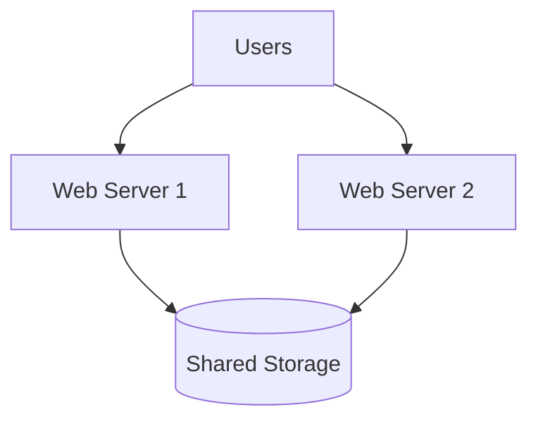
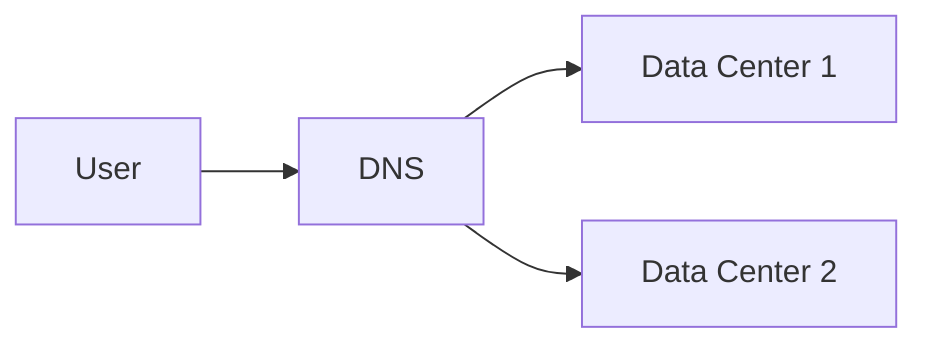
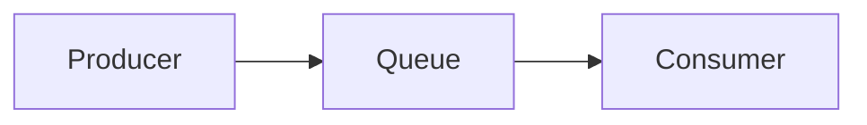

# 🚀 System Design Notes (Part 1)
## Stateless Architecture, Data Centers, Message Queue

---

# 🔄 Stateless Web Tier

## 📌 Definition  
A stateless web tier is a system where web servers do not store client-specific data (state). Instead, all session or user data is stored in a shared storage system like a database or cache.

## 🧠 Theory  
In a stateful system, each server stores user session data locally. This creates a dependency where requests from a user must always go to the same server. If the request is routed to a different server, the system cannot recognize the user, causing failures.

This approach introduces multiple problems such as difficulty in scaling, handling failures, and managing load balancing.

To solve this, we use a stateless architecture where:
- Session data is stored in shared storage (DB, Redis, NoSQL)
- Any server can handle any request
- No dependency on a specific server

This makes the system more scalable, fault-tolerant, and easier to maintain. :contentReference[oaicite:0]{index=0}

---

## 🧩 Diagram

---

# 🌍 Data Centers

## 📌 Definition  
A data center is a physical location where servers and infrastructure are hosted. Multiple data centers are used to improve availability and performance globally.

## 🧠 Theory  
As applications grow globally, users from different regions experience latency when accessing a single data center. To improve performance, systems are deployed across multiple data centers.

Using GeoDNS:
- Users are routed to the nearest data center
- Traffic is distributed geographically

In case of failure:
- If one data center goes down, traffic is redirected to another active data center

This ensures:
- High availability
- Fault tolerance
- Better user experience

However, this introduces challenges like:
- Data synchronization across regions
- Traffic routing
- Deployment consistency :contentReference[oaicite:1]{index=1}

---

## 🧩 Diagram

---

# 📩 Message Queue

## 📌 Definition  
A message queue is a system that enables asynchronous communication between different components using producers and consumers.

## 🧠 Theory  
In tightly coupled systems, services depend directly on each other. If one service is slow or down, it affects the entire system.

A message queue solves this by acting as a buffer:
- Producers send messages to the queue
- Consumers process messages independently

This decouples services and allows them to scale independently.

Example:
- Web server sends photo processing job
- Worker processes it asynchronously

Benefits:
- Improved scalability
- Fault tolerance
- Better system decoupling :contentReference[oaicite:2]{index=2}

---

## 🧩 Diagram

---

# 🧠 Summary

- Stateless systems improve scalability
- Data centers improve global availability
- Message queues enable asynchronous processing

---
