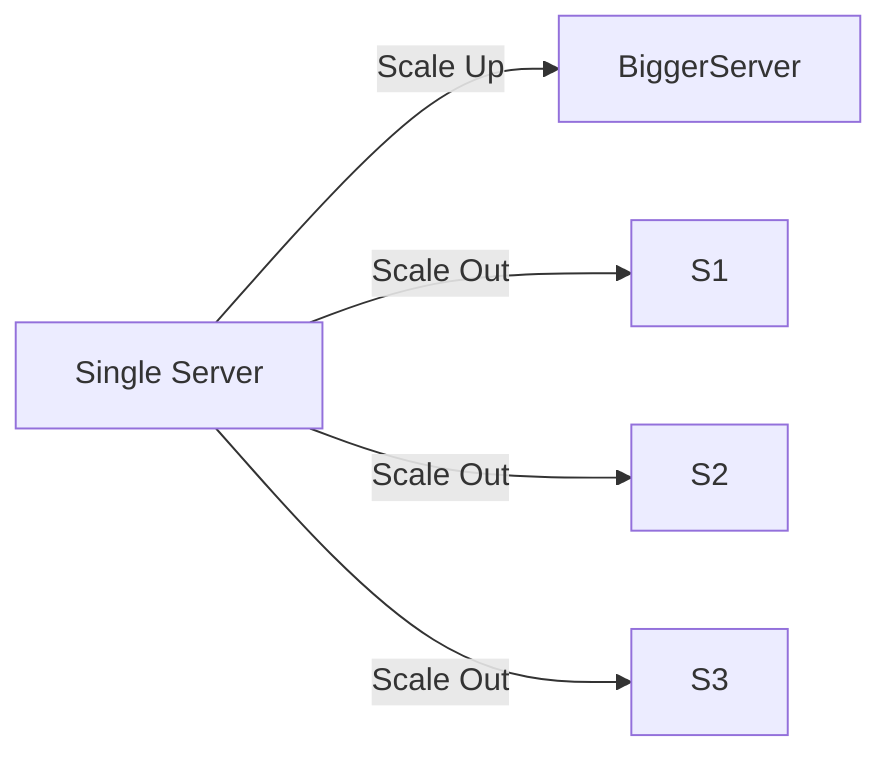
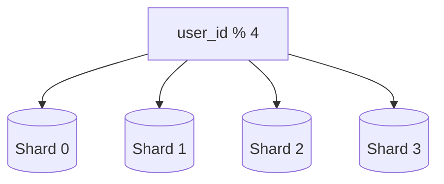

# 🚀 System Design Notes (Part 2)
## Scaling, Sharding, and Advanced System Design

---

# ⚙️ Database Scaling

## 📌 Types of Scaling

### Vertical Scaling (Scale Up)
Increasing resources (CPU, RAM, Disk) of a single server.

### Horizontal Scaling (Scale Out)
Adding multiple servers to distribute load.

---

## 🧠 Theory  

Vertical scaling is simple but has limitations:
- Hardware limits
- Expensive
- Single point of failure

Horizontal scaling is more scalable:
- Add more machines
- Distribute traffic
- Better fault tolerance :contentReference[oaicite:3]{index=3}

---

## 🧩 Diagram

---

# 🧩 Sharding

## 📌 Definition  
Sharding is a database partitioning technique where large datasets are divided into smaller parts called shards.

---

## 🧠 Theory  

As data grows, a single database cannot handle the load. Sharding distributes data across multiple databases using a sharding key.

Example:
- user_id % 4 → determines which shard stores the data

This ensures:
- Better performance
- Scalability
- Distributed load

---

## 🧩 Diagram

---

# ⚠️ Challenges in Sharding

## 🧠 Theory  

Sharding introduces complexity:

- **Resharding**  
  When data grows unevenly, data must be redistributed.

- **Hotspot Problem**  
  Popular data (celebrity users) overloads a shard.

- **Join Complexity**  
  Difficult to perform joins across shards.

- **Data Distribution**  
  Choosing the right sharding key is critical.

---

# 📊 Logging, Metrics, Automation

## 📌 Definition  
These tools help monitor, analyze, and maintain system performance.

---

## 🧠 Theory  

As systems scale, monitoring becomes essential:

- **Logging** → Track errors and issues  
- **Metrics** → Monitor system health (CPU, memory, traffic)  
- **Automation** → CI/CD, deployment, testing  

These tools ensure system reliability and faster issue detection. :contentReference[oaicite:4]{index=4}

---

# 🏁 Final System Evolution

## 🧠 Theory  

Scaling a system is an iterative process. A robust system follows these principles:

- Keep web tier stateless  
- Build redundancy at every layer  
- Use caching wherever possible  
- Use multiple data centers  
- Serve static content via CDN  
- Scale database using sharding  
- Decouple services  
- Monitor and automate systems  

These practices form the foundation for building systems that can handle millions of users. :contentReference[oaicite:5]{index=5}

---

# 🚀 Summary

- Use horizontal scaling for growth  
- Use sharding for large datasets  
- Monitor system continuously  
- Design for failure and scalability  

---
